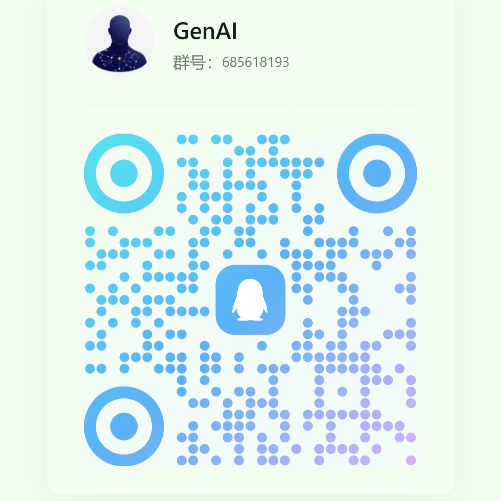

# 🤖 LLMQ-Horizon QQ_Chatbot

基于 NoneBot2 和 LangGraph 的智能 QQ 机器人，支持多模型对话、工具调用和会话管理

工具均采用Function-calling编写,不使用插件，参考[Openai-FC](https://platform.openai.com/docs/guides/function-calling#overview), [Langchain-Tools](https://python.langchain.com/docs/how_to/#tools)

## ✨ 主要特性

- 🔌 丰富的工具集成：代码运行、天气查询、占卜、绘画等
- 🤖 支持多种大模型：OpenAI、Google Gemini、Groq等
- 💬 完善的对话管理：群聊/私聊、多轮对话、会话隔离
- 🎯 灵活的触发方式：@、关键词、命令前缀
- 🎨 多媒体能力：图片分析、音视频处理
- ⚡ 自动的会话管理：超时清理、并发控制
- 🦖 强大的扩展能力：可自行编写tools，可使用tools控制nonebot

## 🚀 快速开始

### 1. 部署环境准备

- Docker 和 Docker Compose
- 稳定的网络环境
- 建议系统：Ubuntu 22.04 及以上, Debian11以上

### 2. 安装步骤

```bash
# 1. 克隆项目
git clone https://github.com/Mgrsc/LLMQ-Horizon.git
cd LLMQ-Horizon

# 2. 准备配置文件
cp config-tools.toml.example config-tools.toml
cp config.toml.example config.toml
cd napcat/config/
mv onebot11_qq.json onebot11_<你的QQ>.json  # 替换为实际QQ号

# 3. 修改配置(参考配置文件中的注释进行修改)
vim config.toml
vim config-tool.toml

# 4. 启动服务
docker compose up -d

# 5. 扫码登录
docker compose logs -f

# 重启 LLMQ 服务
docker compose restart llmq

# 停止所有服务
docker compose down
```

</details>

## 🛠️ 工具配置

<details>
<summary>💻 代码运行(Code Runner - Judge0)</summary>

[Judge0-官方部署教程](https://github.com/judge0/judge0/blob/master/CHANGELOG.md)

1. 准备 Ubuntu 22.04 以上环境及Docker，配置 cgroup v1：
```bash
sudo sed -i 's/GRUB_CMDLINE_LINUX=""/GRUB_CMDLINE_LINUX="systemd.unified_cgroup_hierarchy=0"/' /etc/default/grub
sudo update-grub
sudo reboot
```

2. 部署 Judge0：
```bash
wget https://github.com/judge0/judge0/releases/download/v1.13.1/judge0-v1.13.1.zip
unzip judge0-v1.13.1.zip
cd judge0-v1.13.1

# 生成两个密码并设置密码
openssl rand -hex 32
# 使用生成的密码更新 judge0.conf 文件中的 REDIS_PASSWORD 和 POSTGRES_PASSWORD变量。

# 启动服务
docker-compose up -d db redis
sleep 10s
docker-compose up -d
sleep 5s
```
您的 Judge0 CE v1.13.1 实例现已启动并运行；访问 http://<您的服务器 IP 地址>:2358/docs 获取文档。

3. 配置 config-tools.toml：
```toml
[code_runner]
judge0_url = "http://your-server:2358"
judge0_api_key = "your-api-key"
```
</details>


<details>
<summary>😎 备忘录(memos_manage - Memos)</summary>

[Memos-官方部署教程](https://www.usememos.com/docs/install/container-install)

1. 准备 Ubuntu 22.04 以上环境及Docker：

2. 编写docker-compose.yaml文件
```yaml
services:
  memos:
    image: neosmemo/memos:stable
    container_name: memos
    ports:
      - 5230:5230
    volumes:
      - ./memos:/var/opt/memos
    restart: always
```

3. 启动memos
```shell
docker compose up -d
```
此时就可以在http://<您的服务器 IP 地址>:5230访问到memos，在memos中的Settings中获取Tokens

4. 填写配置文件
```toml
[memos]
url = "http://your-server:xxx"
memos_token = "<填入获取的tokens>"
default_visibility = "PRIVATE"
page_size = 10
user_id = 6
```

</details>


## 📝 命令说明

| 命令 | 说明 |
|------|------|
| `/chat model <模型名>` | 切换对话模型 |
| `/chat clear` | 清理所有会话 |
| `/chat group <true/false>` | 开关群聊隔离 |
| `/chat down` | 关闭对话功能 |
| `/chat up` | 开启对话功能 |
| `/chat chunk <true/false>` | 开关分段发送 |

## ❗ 常见问题

<details>
<summary>1. 登录失败</summary>

- 检查 QQ 号配置是否正确
- 确认 napcat 配置文件格式
- 查看 napcat 容器日志排查问题
</details>

<details>
<summary>2. 工具调用失败</summary>

- 确认模型支持函数调用能力
- 检查相关 API 密钥配置
- 查看 LLMQ 容器日志定位错误
- 在docker容器中加如[LangSmith](https://smith.langchain.com/)进行debug
    ```yaml
     environment:
      - LANGCHAIN_TRACING_V2=true
      - LANGCHAIN_ENDPOINT="https://api.smith.langchain.com"
      - LANGCHAIN_API_KEY="<your_api_key>"
      - LANGCHAIN_PROJECT="<your_project_name>"
    ```
</details>

<details>
<summary>3. 其他问题</summary>

- 其他问题请加QQ群讨论


</details>

## 🔗 相关项目

- [NoneBot2](https://github.com/nonebot/nonebot2)
- [LangGraph](https://github.com/langchain-ai/langgraph)
- [LangChain](https://github.com/langchain-ai/langchain)
- [Judge0](https://github.com/judge0/judge0)
- [Memos](https://github.com/usememos/memos)

## 📄 许可证

MIT License